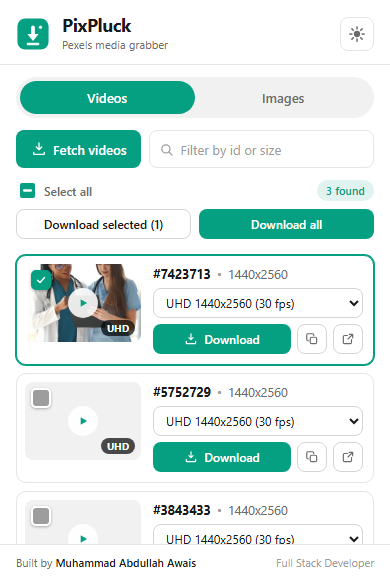
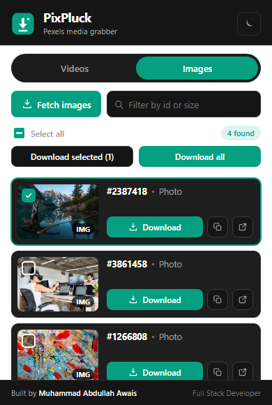
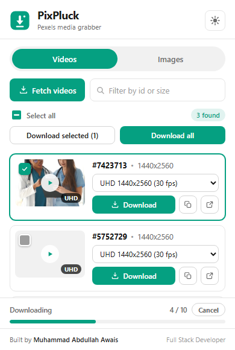

<div align="center">


# PixPluck

### Preview and download Pexels videos and images in one click.

A lightweight Chrome and Edge extension that pulls every video and image out of a Pexels page, shows you real previews, and downloads one, some, or all of them. No link hunting, no sketchy websites, no sign up.

<p>
  
  
  
  
  
</p>

</div>

---

## A look inside

<table>
  <tr>
    <td align="center" width="33%">
      
      <br /><sub><b>Videos tab, light theme</b></sub>
    </td>
    <td align="center" width="33%">
      
      <br /><sub><b>Images tab, dark theme</b></sub>
    </td>
    <td align="center" width="33%">
      
      <br /><sub><b>Batch download, with Cancel</b></sub>
    </td>
  </tr>
</table>

---

## Why you might want it

Grabbing media off Pexels normally means opening each item, clicking through to a download page, and picking a size one at a time. If you need twenty clips for a project, that is twenty round trips. PixPluck turns that into one click.

| What usually happens | With PixPluck |
| --- | --- |
| Open every item in a new tab | Everything on the page is listed at once |
| Guess which file you are getting | See a real preview before you commit |
| Take whatever resolution is offered | Pick the exact resolution from a dropdown |
| Download one file at a time | Download one, a selection, or the whole page |
| No way to stop a big batch | Hit **Cancel** and it stops on the spot |
| Copy links by hand | Copy a direct link or open it in a tab |

It stays out of your way too. It only wakes up on pexels.com, it has no account, no analytics, and no server of its own.

---

## Features

- **Two clean tabs.** Videos and Images, so you always know what you are grabbing.
- **Real previews.** Images show a thumbnail. Videos play a muted preview when you hover the thumbnail.
- **Quality picker.** Every resolution PixPluck can find, in a dropdown, defaulting to the highest.
- **Pick and choose.** Tap thumbnails to select, or use Select all, then Download selected.
- **Download all.** Grab the whole page in one go.
- **Cancel any time.** Nothing further starts downloading the moment you press it.
- **Search and filter.** Narrow the results by id or resolution.
- **Copy link or open in a tab.** For when you want the URL, not the file.
- **Light and dark themes.** Follows your system, and remembers your choice.
- **Tidy downloads.** Everything lands in a `PixPluck` folder, named clearly.

---

## Install

PixPluck is not on the Chrome Web Store yet, so you load it as an unpacked extension. It takes about a minute.

**1. Get the files**

Download this repository as a ZIP and unzip it, or clone it:

```bash
git clone https://github.com/m-abdullah-awais/pixpluck-pexels-downloader-extension.git
```

**2. Open your extensions page**

| Browser | Address |
| --- | --- |
| Chrome | `chrome://extensions` |
| Edge | `edge://extensions` |
| Brave | `brave://extensions` |

**3. Turn on Developer mode**

The toggle sits in the top right corner of that page.

**4. Load it**

Click **Load unpacked** and select the project folder (the one with `manifest.json` in it).

**5. Pin it**

Click the puzzle piece icon in your toolbar and pin PixPluck so it is always one click away.

That is it. There is no build step and nothing to compile.

---

## How to use it

1. Go to any Pexels page. A search results page, a video page, or a photo page all work.
2. If you are on a grid of results, scroll down a bit first so the page loads more items.
3. Click the PixPluck icon in your toolbar.
4. Choose the **Videos** or **Images** tab and press **Fetch**.
5. Browse the previews. For a video, pick a resolution from the dropdown.
6. Download whichever way suits you:
   - Press **Download** on a single card.
   - Tap thumbnails to select several, then press **Download selected**.
   - Press **Download all** to take everything on the page.

Your files land in `Downloads/PixPluck`.

### About that Cancel button

While a batch runs you get a progress bar and a **Cancel** button. Downloads are queued one at a time with a short gap between them, so a big page never floods your machine. Press Cancel and the queue stops immediately, so nothing new begins. Files that already started will finish on their own, and you can manage those from your browser's downloads page.

### A note on video resolutions

Pexels serves each video in several sizes, from 360p up to 4K. On a video's own page the full list is usually available, so the quality dropdown fills up nicely. On a busy grid of search results the page often only exposes the preview quality, so a clip there may show a single option. If you want every resolution for one specific clip, open that clip's own page and fetch again.

---

## Permissions, and why each one exists

PixPluck asks for the smallest set it can, and nothing more.

| Permission | Why it is needed |
| --- | --- |
| Access to `pexels.com` pages | To read the media on the page you are looking at. It cannot touch any other site. |
| `downloads` | To save the files you choose. |
| `storage` | To remember your theme and last used tab. |

---

## Privacy

Everything runs on your machine. PixPluck has no server, no analytics, no tracking, and no account. Nothing about you or what you download ever leaves your browser. The only network requests are the ordinary ones your browser makes to fetch the previews and the files you asked for.

---

## FAQ

**Does this work on sites other than Pexels?**
No, and that is on purpose. It only has permission for pexels.com.

**Why does a video only show one resolution?**
You are most likely on a search grid, which only loads the preview file. Open that clip's own page and fetch again to see every size.

**Why did nothing show up?**
The page may still have been loading, or you may be on a page with no media. Scroll a little, then press Fetch again.

**Can I use these files commercially?**
That is between you and the [Pexels License](https://www.pexels.com/license/), not this tool. Pexels content is free to use with generous terms, but please read it and credit creators when you can.

**Will it slow down my computer if I download a whole page?**
No. Downloads are queued one at a time with a gap between them, and you can stop the queue at any moment with Cancel.

---

## Tech notes

- Manifest V3, plain HTML, CSS, and JavaScript. No framework, no bundler, no build step.
- The popup injects a small self contained scraper into the active tab with `chrome.scripting.executeScript`, then renders whatever it returns.
- Downloads run through a cancellable queue in the background service worker, so a batch keeps going even if you close the popup, and one Cancel stops everything.
- The only dev time dependency is `sharp`, used once to turn `assets/logo.master.svg` into the PNG icon set.

Regenerate the icons after editing the logo:

```bash
npm install
npm run icons
```

Run the tests:

```bash
node assets/parser.test.mjs   # checks the media parser
node assets/queue.test.mjs    # checks the download queue and cancel
```

### Project layout

```
manifest.json     extension manifest (MV3)
popup.html        popup markup
popup.css         design system and both themes
popup.js          popup logic: tabs, fetch, render, select, download, theme
scraper.js        the self contained page scraper
background.js     cancellable download queue
icons/            generated PNG icon set
assets/           logo source, icon generator, tests
screenshots/      images used in this README
```

---

<div align="center">

## The developer


### Muhammad Abdullah Awais

**Full Stack Developer**

I build fast, clean, practical tools that solve a real annoyance. PixPluck came out of one: needing a pile of stock clips for a project and not wanting to click through fifty download pages to get them.

🌐 [www.abdullahawais.com](https://www.abdullahawais.com) &nbsp;•&nbsp; 📧 [contact@abdullahawais.com](mailto:contact@abdullahawais.com)

<p>
  <a href="https://www.abdullahawais.com"></a>
  <a href="https://github.com/m-abdullah-awais"></a>
  <a href="https://www.linkedin.com/in/m-abdullah-awais-programmer"></a>
  <a href="https://www.youtube.com/@m_abdullah_awais"></a>
  <a href="https://www.instagram.com/m_abdullah_awais"></a>
  <a href="mailto:contact@abdullahawais.com"></a>
</p>

</div>

---

## Contributing

Issues and pull requests are welcome. If you hit a Pexels page where the fetch comes up short, [open an issue](https://github.com/m-abdullah-awais/pixpluck-pexels-downloader-extension/issues) with the URL and I will take a look.

## License

Released under the [MIT License](LICENSE). Use it, learn from it, build on it.

## Disclaimer

> PixPluck is an independent, unofficial tool. It is not affiliated with, endorsed by, or connected to Pexels in any way. Pexels and the Pexels logo are trademarks of their respective owner. PixPluck only helps you download media you are already free to use, so please follow the [Pexels License](https://www.pexels.com/license/) and credit creators where you can.

---

<div align="center">

### Found PixPluck useful?

Star the repo, it genuinely helps other people find it.

<a href="https://github.com/m-abdullah-awais/pixpluck-pexels-downloader-extension">
  
</a>

<br />
<br />

<sub>Built with care by <a href="https://www.abdullahawais.com"><b>Muhammad Abdullah Awais</b></a></sub>

</div>
